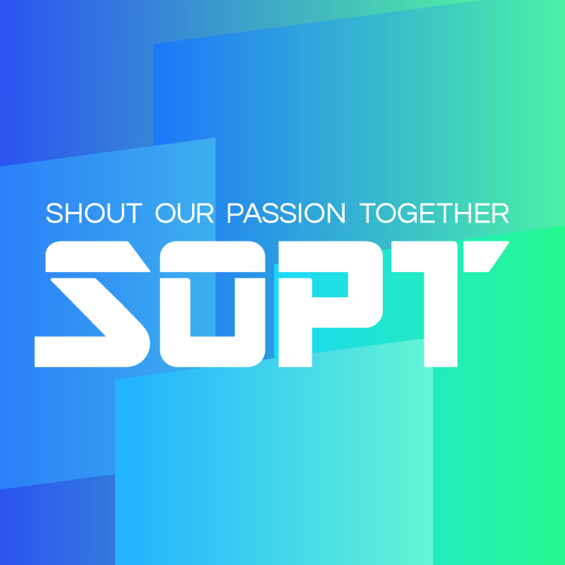

# # SOPT

* SOPT

대학생 IT 창업 동아리로써, 열정을 가진 전공, 비전공의 대학생들이 모여서 기획, 디자인, 개발(Android, iOS, Server)의 각 파트를 수료하고 AppJam이라는 해커톤을 통해서 App을 개발합니다. 더 나아가 창업을 할 수도 있습니다.

* Site : [http://sopt.org/wp/](http://sopt.org/wp/)
* Facebook : [https://www.facebook.com/clubsopt/](https://www.facebook.com/clubsopt/)

* 1차 세미나
    * View / Layout과 친해지기
    * Code : [Seminar1](https://github.com/WooVictory/Inno_SOPT_22th_Android/tree/master/Seminar1)

* 2차 세미나
    * Activity / Fragment에 대해서
    * Code : [Seminar2](https://github.com/WooVictory/Inno_SOPT_22th_Android/tree/master/Seminar2)

* 3차 세미나
    * 게시판 / Recyclerview을 다뤄보자!
    * Code : [Seminar3](https://github.com/WooVictory/Inno_SOPT_22th_Android/tree/master/Seminar3)

* 4차 세미나
    * 통신 / Retrofit2
    * Code : [Seminar4](https://github.com/WooVictory/Inno_SOPT_22th_Android/tree/master/Seminar4R)

* 5차 세미나
    * 디자이너와 합동 세미나
    * Code : [Seminar5](https://github.com/WooVictory/Inno_SOPT_22th_Android/tree/master/Seminar5)

* 6차 세미나
    * 우아한 테크 캠프 코딩 테스트로 인하여 참여하지 못했습니다.

* 7차 세미나
    * Splash 및 간단한 애니메이션
    * 3차 세미나 코드에 추가해서 프로젝트를 진행하였습니다.
    * Code : [Seminar7](https://github.com/WooVictory/Inno_SOPT_22th_Android/tree/master/Seminar3)

* 8차 세미나
    * SNS 연동(Facebook)
    * Code : [Seminar8](https://github.com/WooVictory/Inno_SOPT_22th_Android/tree/master/Seminar8)

